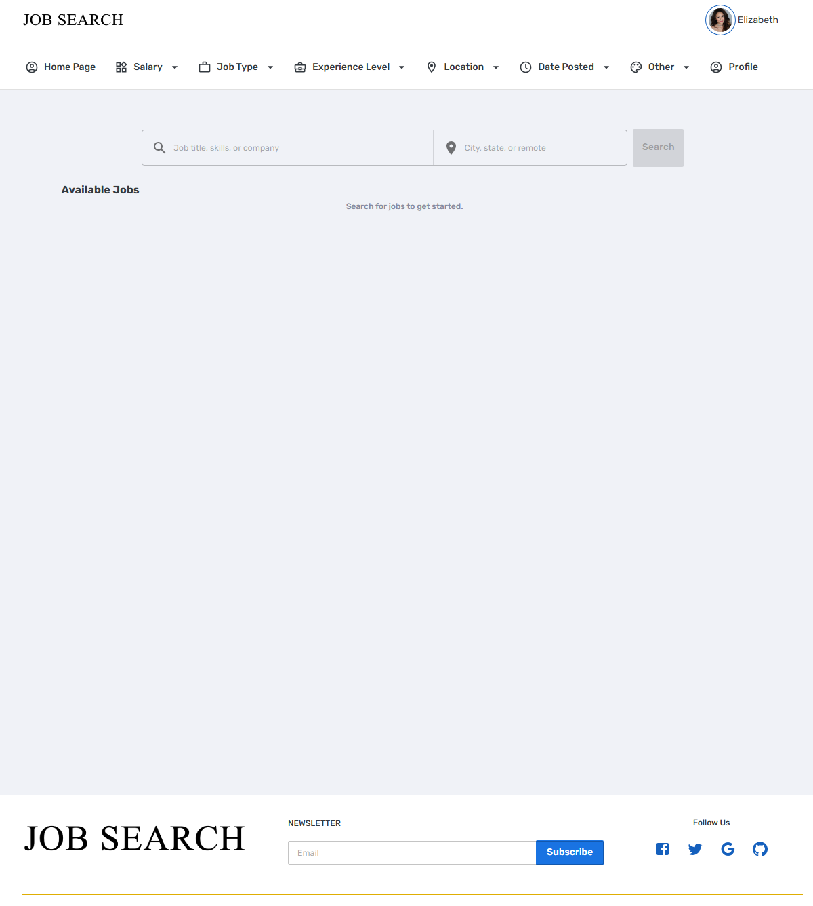
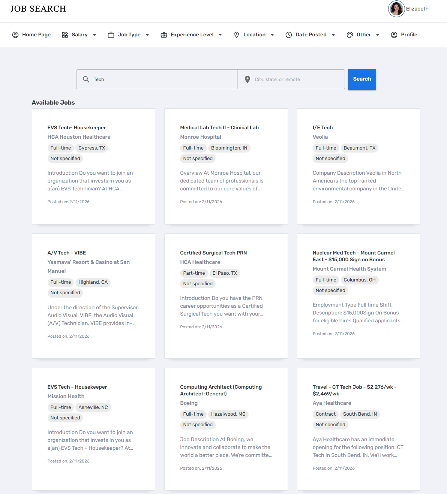
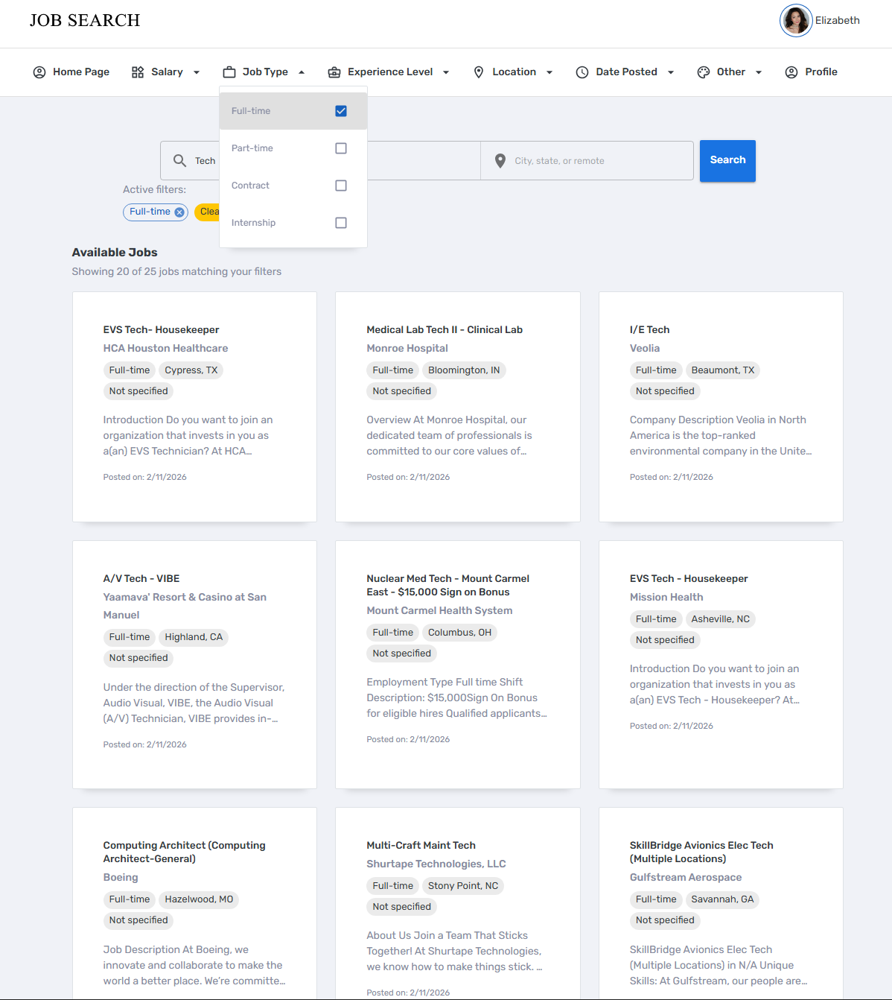

#
Collaborators: Chawewo, Eduardochavez1174, Joseph Rangel
Citations: Utilized Free React-mui-template for file structure
- https://github.com/Tono2007/slim-free-react-mui-template

# Job Scraper Platform
Web application that scrapes job listings and displays searchable results.

## Images





## Features
- Scrapes job listings automatically
- Search and filter results
- Dashboard UI for viewing jobs

## Tech Stack

### Front-End
   - HTML5 for structure
   - CSS3 for styling and responsiveness
   - JavaScript for interactivity
   - React.js for the UI framework

### Back-End
   - Python as the core language
   - Flask for server routing, authentication, and APIs
   - Beautiful Soup for web scraping job listings


## Getting Started

### Prerequisites
Ensure the following tools are installed on your system:
- **Node.js** (v18 or later) - [Download here](https://nodejs.org)
- **Git** (optional, but recommended) - [Download here](https://git-scm.com)

### Installation
1. Clone the repository:
   ```bash
   git clone https://github.com/Joseph-ZR/job-scraper-platform.git
   
   and then switch to the UpdatedRisky branch for the most recently updated project

### Running the server
Make sure to run **npm install** in the frontend/Main directory to install require dependencies.

Aftewards you are able to run the command **npm run dev** to start the server

To exit out of the server you must use **Ctrl + C** in your terminal.

### Running the Backend Server
Make sure to run **npm install** in the Backend directory to install require dependencies.

Aftewards you are able to run the command **npm run dev** to start the server

To exit out of the server you must use **Ctrl + C** in your terminal.